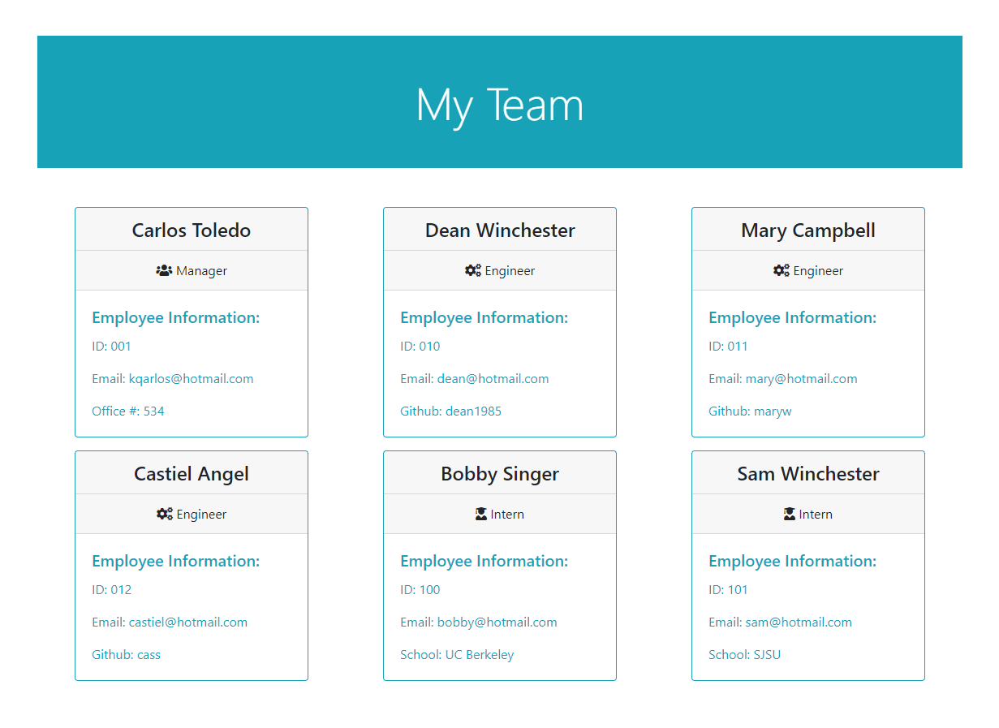

# Team Profile Generator

## Getting Started

Steps to install application:
1. Clone repository.
2. In the directory with server.js run npm install
3. Start server and answer prompts
4. HTML Generated

```
git clone git@github.com:kqarlos/team-profile-generator.git
npm instal
node server.js

```

## Site Pictures

1. Working app


2. Example of a team profile generated




## Code Snippets


1. nextEmployee();

```javascript

nextEmployee() {
    this.promptRole().then((role) => {
        if (role === "Exit") {
            this.renderHTML();
            this.end();
            }
        else {
            this.promptInfo(role).then((data) => {
                switch (role) {
                    case "Manager":
                        var employee = new Manager(data.name data.id, data.email, data.officeN);
                        break;
                    case "Engineer":
                        var employee = new Engineer(data.name, data.id, data.email, data.github);
                        break;
                    case "Intern":
                        var employee = new Intern(data.name, data.id, data.email, data.school);
                        break;
                }
                this.employees.push(employee);
                this.nextEmployee();
            });
        }
    });
}
    
```
* This function uses recursion to keep gathering employee information from the user until the user quits the program. It calls on a function that will prompt the user to select to either add an employee or to exit the application. If the user decides to exit, the application will call to generate the team profile HTML and end the appliciaton. Otherwise, it will ask user for further information on the employee and create a new _Employee_ object based on that information. Next, it will call itself to prompt the user again whether to add another employee or exit the application.


2. promptInfo(role)

```javascript

    //prompt user for employee information and return it
    promptInfo(role) {
        switch (role) {
            case "Manager":
                return inquirer.prompt(this.managerPrompt).then(function (data) {
                    return data;
                });
                break;
            case "Engineer":
                return inquirer.prompt(this.engineerPrompt).then(function (data) {
                    return data;
                });
                break;
            case "Intern":
                return inquirer.prompt(this.internPrompt).then(function (data) {
                    return data;
                });
                break;
        }
    }

```
* This function will return a function that will prompt the user to input information according to the type of employee they've chosen. This function comes with a promise that returns the data collected by _inquirer.prompt()_


## Built With

* [HTML](https://developer.mozilla.org/en-US/docs/Web/HTML)
* [CSS](https://developer.mozilla.org/en-US/docs/Web/CSS)
* [Bootstrap](https://getbootstrap.com/)
* [Javascript](https://www.javascript.com/)
* [Node.js](https://nodejs.org/en/)

## Deployed Link

* [See Live Site](https://kqarlos.github.io/team-profile-generator)

## Author

 * **Carlos Toledo** 

## Links

- [Link to site repository](https://github.com/kqarlos/team-profile-generator)
- [Link to Github](https://www.github.com/kqarlos)
- [Link to LinkedIn](https://www.linkedin.com/in/carlos-toledo415/)


## Acknowledgments

* [W3 Schools](https://www.w3schools.com/)
* [Bootstrap components](https://getbootstrap.com/docs/4.4/components/navbar/)
* [MDN Web Docs](https://developer.mozilla.org/en-US/docs/Web/API/Document_Object_Model)